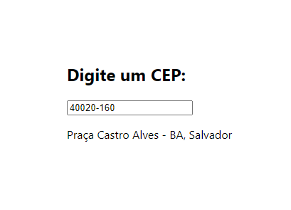

## Usando o FETCH

- O FETCH API é uma interface para gerenciar requisições http
- Como o seu primeiro retorno é uma promise você precisa usar o then duas vezes

~~~

   fetch('https://jsonplaceholder.typicode.com/todos')
     .then(resposta => resposta.json())
     .then(data => console.log(data));
     
~~~

